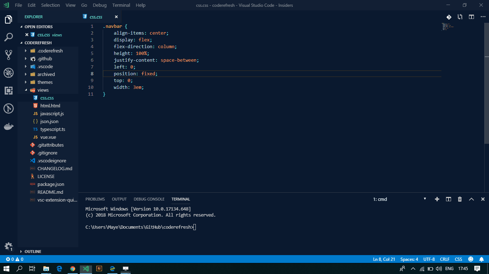

# [Code Refresh VS Code Theme](https://marketplace.visualstudio.com/items?itemName=mayeedwin.coderefresh)

And we have the stable version, up and running! Check out the [Change Log on VS Code](https://marketplace.visualstudio.com/items?itemName=mayeedwin.coderefresh) for any issues resolved or updates added.

## Installation

[Install Code Refresh](https://marketplace.visualstudio.com/items?itemName=mayeedwin.coderefresh). It's available in Visual Studio Marketplace! OR

Launch VS Code Quick Open ( Ctrl + P ), paste the following command and press enter.

```sh
ext install mayeedwin.codereresh
```

## [Beautiful and sparks refresh in writing code](https://marketplace.visualstudio.com/items?itemName=mayeedwin.coderefresh)



## Features // All about Code Refresh

- Beautiful, Less Eye Strain
- Fresh, Progressive, Just new
- Free, Open Source, PR welcome

## Demo with Code Refresh in play

Load [preview in your browser here](.coderefresh/coderefreshtheme.gif)

**Enjoy 😊 🐥** and thanks for checking it out. Let's connect on twitter [@mayeedwin1](https://twitter.com/mayeedwin1) : )
